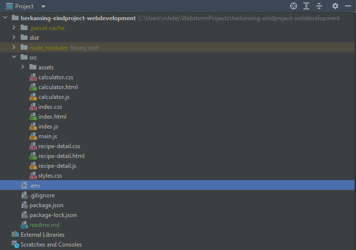

# Clueless Cook
***
### This web application contains 2 key features.
-   ###### recipe search function, based on user input.
-   ###### A calculator for finding ingredients and counting calories and macro's, based on user input.
***
# Table of contents
<!-- TOC -->
* [Installation](#installation)
* [Content](#content)
    * [index](#index)
    * [styles](#styles)
    * [main](#main)
    * [recipe-detail](#recipe-detail)
    * [calculator](#calculator)
<!-- TOC -->
***

# Installation
1. Install Node.js from https://nodejs.org/en/
2. Open project in IDE.
3. Open terminal.
4. Type 'NPM install'. (this will automatically install all neccesary nodes)
5. Add the provided .env file to the main project map. (the .env file contains the API keys.) 

6. Open terminal.
7. Type NPM run start. (to start the application)
8. Wait until the server is built and running. (the terminal will display a message once ready)
9. Go to [http://localhost:1234](http://localhost:1234)
***
# Content
## index
#### This is the homepage, divided into three separate files, the HTML, CSS and JS:
##### index.html
###### Here you will find all sections and HTML elements that makeup the homepage.
#### index.css
###### Here you will find all styles that are applied to the index.html files.
#### index.js
###### Here you will find two seperate functions that inject search results on the index page.
## styles
#### This is the styles.css stylesheet.
###### This file contains only global styles, applied to all the HTML files. This file does not contain any style that is applied individually to HTML files. You will find those in accompanying files.
## main
#### This is the main.js javascript file.
###### This file contains the global get requests for fetching data from the API. Which is then exported to individual .js files for local use.
## recipe-detail
#### This is the recipe details page, divided into three seperate files, HTML, CSS and JS:
##### recipe-detail.HTML
###### Here you will find all sections and HTML elements that makeup the homepage.
##### recipe-detail.css
###### Here you will find all styles that are applied to the recipe-detail.html files.
##### recipe-detail.JS
###### Here you will find the script that injects the details of the recipe the user has selected. The details are injected onto the recipe details page. Which will open up automatically once the user selects a recipe of choice.
## calculator
#### This is the calculator page, divided into three seperate files, HTML, CSS and JS.
##### calculator.HTML
###### Here you will find all sections and HTML elements that makeup the calculator page.
##### calculator.css
###### Here you will find all styles that are applied to the calculator.html files.
##### calculator.js
###### Here you will find the script that injects Kcal information into the table at the calculator page. Also contains the script for adding and calculating multiple ingredients together.
***

